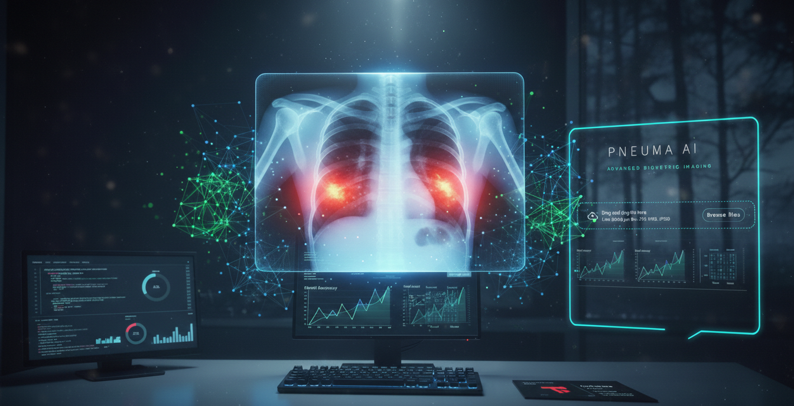

# **Pneuma AI** - Deep Learning X-Ray Diagnostic Assistant


[](https://gemini.google.com/app)
*Image source: [Gemini](https://gemini.google.com/app)*

## Description
Medical imaging interpretation requires years of specialized training. This project bridges the diagnostic gap by utilizing a Convolutional Neural Network (CNN) to automate the detection of Pneumonia from chest X-ray images. Built with TensorFlow/Keras, the system classifies images into 'Normal' or 'Pneumonia' with high precision, providing radiologists with a secondary "pulse check" on complex cases.

The application is deployed via a custom-engineered Streamlit dashboard, featuring real-time diagnostic sequences, biometric analytics, and interpretable heatmaps.

Visit me: [PNEUMA AI](https://computer-vision-pneuma-ai.streamlit.app/)

## Strategic Insights
### **The Value**  
The Value PNEUMA AI empowers radiologists by providing a rapid secondary support. The assistant delivers a high-speed prediction based on provided Lung X-Ray image, followed by a visual confirmation layer (GRAD-CAM heatmap). This allows clinicians to see the "reasoning" behind the AI's score without the AI making the final medical call.

**Note**: The heatmap is generated to provide transparency for the user; it is not used by the model to calculate the diagnosis.

**The Diagnostic Pipeline**:
- **Analysis**: The system passes the preprocessed $150 \times 150$ radiograph through the trained CNN. This produces a raw Sigmoid confidence score. If the probability exceeds $0.5$, a "Pneumonia Detected" status is triggered.

- **Heatmap**: Once the prediction is made, the system initiates a Grad-CAM sequence. It goes back into the model's architecture to the last convolutional layer (in this case ``conv2d_35``) and calculates which parts of the image were most influential in reaching that specific score. This results in the visual heatmap overlay.

- **Decoupled Logic**: The prediction and the visualization are decoupled. This ensures the diagnostic result is delivered instantly, while the heatmap is generated as a secondary supportive visual for the clinician.

## Installation

1. **Clone the project:**

```
    git clone https://github.com/butkutez/computer-vision.git
    cd COMPUTER-VISION
```
2. **Create virtual environment (Windows)**
```
   python3.13 -m venv .venv
   .\.venv\Scripts\Activate.ps1
   ```

3. **Install dependencies**  
```
    pip install -r requirements.txt
```
4. **Initialize the Database** 

 - Download Data using Terminal - Fetch raw files from [Kaggle](https://www.kaggle.com/paultimothymooney/chest-xray-pneumonia) (Make sure to adapt the code with your generated API key and your personal Kaggle username).

```
    python setup.py
```

5. **Run the Pneuma AI Assistant** - Once the database is initialized, launch the app:

```
    streamlit run app.py
```

## Repo Structure

```
COMPUTER-VISION
├── assets/                    
├── COMPUTER-VISION/           
│   ├── pneumonia_model.keras  # Trained CNN-ResNet Model (LFS)
│   └── training_history.png   
├── app.py                     # Main Streamlit Application
├── Data_exploration.ipynb     # Dataset analysis notebook
├── Grad_CAM.ipynb             # Heatmap logic development
├── README.md              
├── requirements.txt         
├── setup.py 
├── .gitattributes              # Git LFS configuration                  
└── styles.py                   # Cinematic Glassmorphism CSS
```

## Process & Methodology

```
┌──────────────┐      ┌────────────────┐      ┌──────────────┐      ┌──────────────┐
│  X-Ray Image │ ──►  │   CNN Engine   │ ──►  │   Diagnosis  │ ──►  │   Grad-CAM   │
│   (Upload)   │      │(Classification)│      │  (Decision)  │      │   (Heatmap)  │
└──────────────┘      └────────────────┘      └──────────────┘      └──────────────┘
 150x150 Array         Feature Extraction      Sigmoid Score            Additive
 Raw Pixel Data        & Pattern Mapping        (0.0 to 1.0)         
```
The application follows a modular "Decoupled" approach, where the diagnostic result is prioritized for speed, followed by a secondary explainability layer.

### I. Biometric Validation Layer
Before the AI processes the image, the system performs a quality check using OpenCV. Standard X-rays are nearly 100% grayscale; the app calculates color saturation and pixel intensity to verify the upload.

**Why this is important**: This prevents "Out-of-Distribution" errors. If a user uploads a random color photo (like a raccoon or a landscape), the system triggers a high-opacity warning instead of providing a false medical diagnosis.

### II. CNN Diagnostic Engine 
The core logic uses a Convolutional Neural Network (CNN) optimized with a ResNet-based architecture.
- **Prediction**: The model returns a sigmoid confidence score. Scores above 0.5 trigger a "Pneumonia Detected" status, while lower scores indicate a "Normal" status.
- **Preprocessing**: Images are normalized to a scale of 0 to 1 and resized to $150 \times 150$ pixels to match the input shape of the trained layers.

### III. Explainable AI (Grad-CAM) 
To ensure the AI is not a "black box," I implemented Grad-CAM (Gradient-weighted Class Activation Mapping).
- **Visual Transparency**: The system identifies the last convolutional layer and calculates the gradients to see which pixels influenced the decision most.

- **Diagnostic Overlay**: A "Jet" colormap heatmap is generated and overlayed on the original radiograph, showing the exact areas (lung lobes) the AI focused on.

### IV. Cinematic User Interface
The frontend is built with Streamlit, featuring a custom CSS injection for a "Glassmorphism" look.

- **Interactive Analytics**: Users can toggle a "System Analytics" view to see the *Confusion Matrix* and a *Biometric Radar chart*, showing the model's Precision, Recall, and F1-Score.

- **Session Management**: Using ``st.session_state``, the app maintains the diagnostic sequence across reruns, ensuring a smooth transition from upload to result.


<!-- ```python
def generate_sql(user_question):
    """Translating natural language into SQL by injecting the schema into the prompt."""
    schema = get_schema_from_file()

    # Engineering the prompt to enforce a 'SQL-only' output format
    prompt = f"Schema: {schema}\nRequest: {user_question}\nReturn only SQL."
    response = client.models.generate_content(model='gemini-2.5-flash', contents=prompt)
    
    # Sanitizing the response by stripping backticks and markdown formatting
    return response.text.strip().replace("```sql", "").replace("```", "")
```
## Robust SQL Execution

This demonstrates the ability to manage database connections safely and handle potential AI-generated errors.

```python
def run_query(sql):
    """Executing the generated SQL against the SQLite database and fetching raw results."""
    conn = sqlite3.connect('simpsons.db')
    cursor = conn.cursor()
    try:
        cursor.execute(sql)
        rows = cursor.fetchall()
        return rows
    except Exception as e:
        return f"SQL Error: {e}"
    finally:
        # Ensuring the database connection is closed safely
        conn.close()
``` -->

## **The Result:**  
By combining TensorFlow with a high-end Streamlit UI, I transformed a raw deep-learning model into a medical screening tool.

- **Accuracy**: The model achieves **91% accuracy**, with a high Recall (**95%**) to minimize False Negatives in a clinical context.

- **Deployment**: Live on Streamlit Cloud using Git LFS to manage the 228MB model file.

## **Future Improvements:**  

- *Multi-Class Classification*: Transition from binary (Normal/Pneumonia) to multi-label classification to identify specific types of pneumonia (Bacterial vs. Viral) or other lung pathologies like COVID-19 and Tuberculosis.

- *Targeted Layer Ablation*: Conduct a sensitivity analysis across different residual blocks (e.g., comparing conv2d_35 vs. earlier layers) to determine which feature maps provide the most "clinically relevant" heatmaps for radiologists.

- **GPU Acceleration Optimization**: Transition to a specific TensorFlow-GPU compatible version (e.g., v2.10 or lower for native Windows support or specific Linux CUDA-mapped builds) to utilize NVIDIA hardware. This project currently utilizes version 2.20.0. 

## **Timeline**
This solo project was completed over 5 days.

## **Personal Situation**
This project was completed as part of the AI & Data Science Bootcamp at BeCode.org.

**Connect** with me on [LinkedIn](https://www.linkedin.com/in/zivile-butkute/).